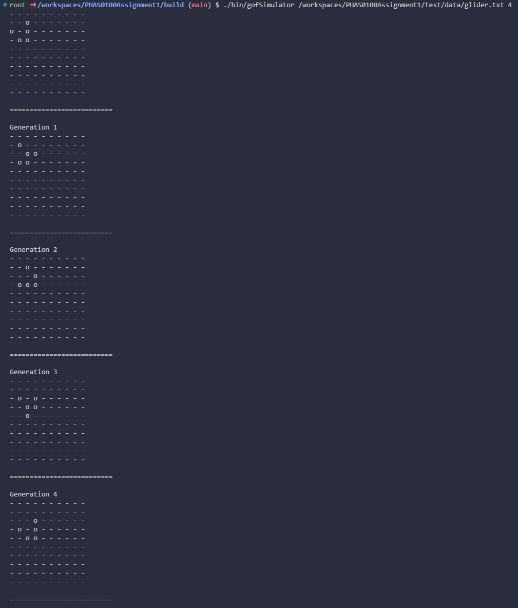
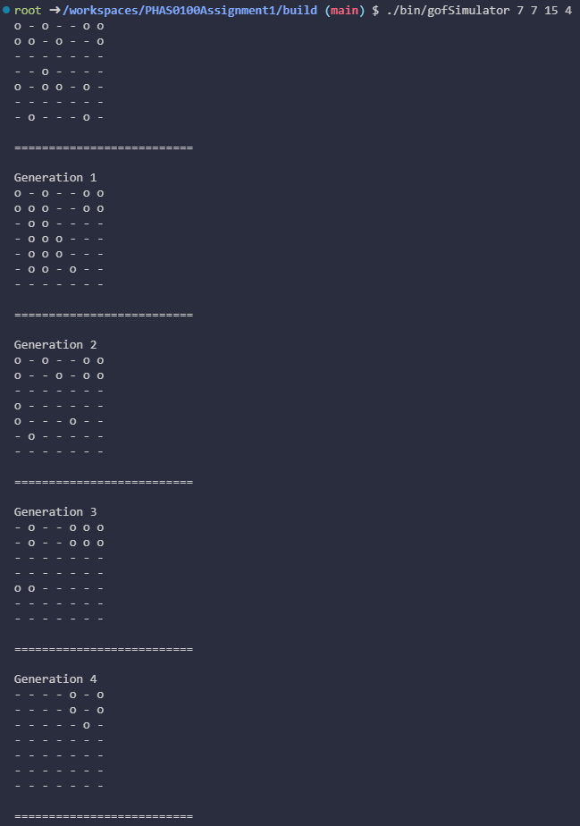
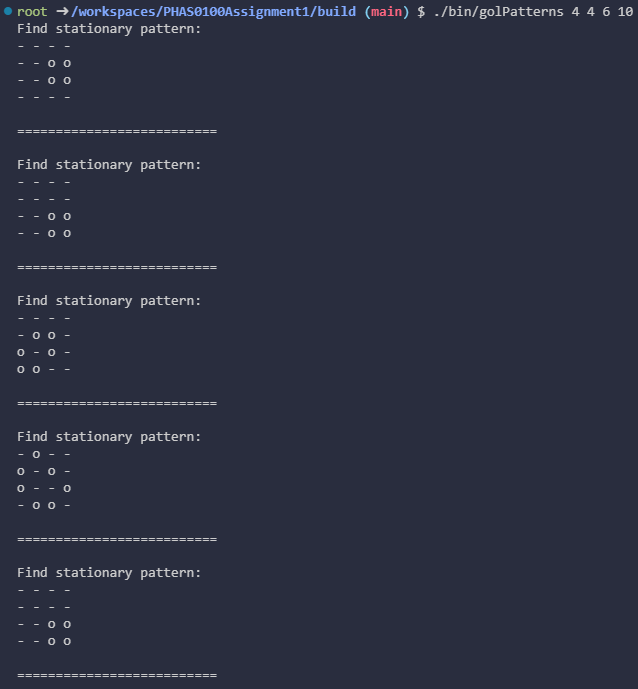
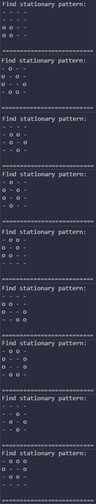

# PHAS0100Assignment1 The Game of Life

## Contents
---

- [Background](#Background)
- [Rules](#Rules)
- [Command-line_applications](#Command-line_applications)

## Background
---

The Game of Life, also known simply as Life, is a cellular automaton devised by the British mathematician John Horton Conway in 1970. It is a zero-player game, meaning that its evolution is determined by its initial state, requiring no further input. One interacts with the Game of Life by creating an initial configuration and observing how it evolves. It is Turing complete and can simulate a universal constructor or any other Turing machine.\
--WIKIPEDIA

## Rules
---

i. A dead cell with exactly three live neighbours should become a live cell.\
ii. A live cell with two or three live neighbours should stay alive.\
iii. A live cell with less than two or more than three live neighbours should die.

## Command-line_applications
---

### Gof_simulator

To get help of application:

```
./build/bin/gofSimulator --help
```

or

```
./build/bin/gofSimulator -h
```

To play Gof_simulator, you can choose between the following two options:\
1. Specify a text file input:

```
./build/bin/gofSimulator [path] [generations]
```

2. Start with random cell contents for the initial conditions:

```
./build/bin/gofSimulator [row] [col] [generations]

./build/bin/gofSimulator [row] [col] [num_alive] [generations]
```

After running with glider.txt input file:\


After starting a 7 by 7 grid with random initial cell values (15 cells alive):\


### Gol_stationary_patterns

To play Gol_stationary_patterns, you can type in the following command:

```
./build/bin/golPatterns [row] [col] [num_alive] [generations]
```

Example:


Still lifes patterns in a 4 by 4 grid of cells:\
